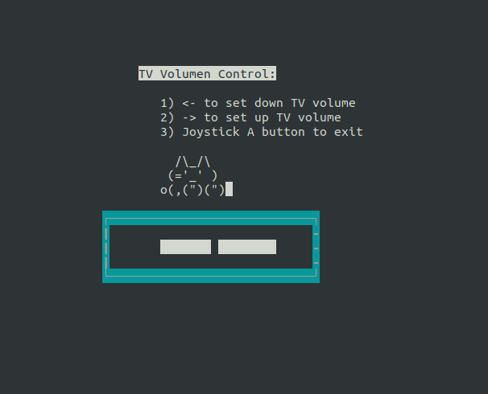

# Equipo empleado
Portátil Lenovo 3000 v200

Especificaciones:
- CPU: Intel ® Core(™) 2 Duo T8300 @ 2.40 GHz
- RAM: 2 GB

Para comprobar el soporte opengl:
```
glxinfo | grep "OpenGL version"
```
En nuestro caso nos devuelve:
```
OpenGL version string: 2.1 Mesa 13.0.6
```
Necesitamos soporte de OpenGL 2.0 para libgdx así que este portátil cumple los requisitos mínimos.

El sistema operativo es una Debian GNU Linux 9 (stretch) 64-bits. Kernel 4.9.65

## Preparaciones del portátil

1) Habilitar la sesión automática en el usuario (Pestaña de configuración Users/Usuarios).

2) Deshabilitar el bloqueo automático de la sesión del usuario (Pestaña de configuración Privacy/Privacidad).

3) Ejecutar *shutdown* sin contraseña

Para apagar el portátil desde emulationstation se debe ejecutar el comando shutdown sin que pida contraseña. Esto se puede cambiar con el comando `sudo visudo`.

```
sudo visudo
```

y luego añadir a la configuración la siguiente línea

```
<youruser>	ALL=NOPASSWD:	/sbin/shutdown
<youruser>	ALL=NOPASSWD:	/sbin/reboot
<youruser>	ALL=NOPASSWD:	/sbin/poweroff
```
donde `<youruser>` es el usuario que ejecuta emulationstation.

# Instalación Retropie
1. Se usa como base un S.O. Debian  https://xubuntu.org/download
2. Se instala retropie siguiendo las instrucciones en https://retropie.org.uk/docs/Debian/. Se realiza la instalación básica.

La versión del script es la 4.4.3.

Siguiendo estas instrucciones, nos crea un directorio RetroPie donde se instalarán las roms y juegos

# Autostart (EmulationStation)

El autostart de emulationstation se instala en

```
 $HOME/.config/autostart/retropie.desktop
```

#Pruebas
Juegos sobre emuladores de consolas:

N64:Se han probado diferentes juegos que van de forma fluida.

# Instalar el software custom de Retrodiosa

Ejecutar el script de instalacion que se encuentra en el directorio raíz del proyecto https://github.com/aindustriosa/retrodiosa_sw

1. Clonar el proyecto retrodiosa_sw

```
git clone https://github.com/aindustriosa/retrodiosa_sw.git
```

Ejecutar el script de instalación

```
./install_software.sh
```

Para añadir juegos de LibGDX la forma más cómoda es usar el servidor http que se encuentra en la dirección http://<dir-ip-servidor>:8000/

Para incluir juegos de LibGDX hay que incluir el mapping de teclas a joystick. Ver sección [Json para el mapeo de teclas](#mapping-de-joystick-y-teclas).


# Incluir juegos custom en Emulation Station (Detallado: mejor usar el script de instalación)
## Añadir un nuevo sistema y theme a Emulation Station


https://github.com/RetroPie/RetroPie-Setup/wiki/Add-a-New-System-in-EmulationStation
https://github.com/retropie/retropie-setup/wiki/Doom#to-launch-doom-mods-pwads


Pasos:
1. Crear un sistema nuevo (copiando la estructura de otro existente) y cambiar el nombre. 
Copiar la estructura de /etc/ a /opt/
```
sudo cp /etc/emulationstation/es_systems.cfg /opt/retropie/configs/all/emulationstation/es_systems.cfg
```
Luego hay que añadir los nuevos sistemas a /opt/retropie/configs/all/emulationstation/es_systems.cfg


1. Crear un theme siguiendo las mismas instrucciones. Ojo: puede dar problemas con svg pero acepta png.


En este caso se crean dos sistemas en es_systems.cfg (Ruta /opt/retropie/configs/all/emulationstation/es_systems.cfg). Uno de ellos para ejecutar juegos .nes y otro para ejecutar scripts genéricos .sh (y que se usará para lanzar juegos de LIBGDX desde Emulation Station).

```
  <system>
    <name>aindustriosa</name>
    <fullname>A industriosa Games</fullname>
    <path>/home/nicoyiago/RetroPie/roms/aindustriosa</path>
    <extension>.7z .nes .zip .7Z .NES .ZIP</extension>
    <command>/opt/retropie/supplementary/runcommand/runcommand.sh 0 _
SYS_ nes %ROM%</command>
    <platform>favs</platform>
    <theme>aindustriosa</theme>
  </system>

  <system>
    <name>aindustriosalibgdx</name>
    <fullname>A industriosa Games for LIBGDX</fullname>
    <path>/home/nicoyiago/RetroPie/roms/aindustriosa</path>
    <extension>.sh</extension>
    <command>%ROM%</command>
    <platform>favs</platform>
    <theme>aindustriosa_libgdx</theme>
  </system>
```

Cada uno de ellos apunta a un Theme diferente y que se pueden encontrar en:

```
/opt/retropie/configs/all/emulationstation/themes/carbon/aindustriosa*
```

En estos themes simplemente se han añadido logos custom de A Industriosa.(que se configuran en el theme.xml).
Potenciales problemas con la configuración del joystick para el segundo player
https://www.raspberrypi.org/forums/viewtopic.php?t=55013

# Integración de juegos de LIBGDX en Emulationstation
LIBGDX es una librería open source para hacer juegos multiplataforma. Los juegos se programan en Java y se pueden exportar a Android, HTML o iOS.

En este caso se han importado juegos en formato Desktop (.jar). Estos juegos se pueden compilar como ejecutables con el siguiente comando:
```
./gradlew -b build.gradle desktop:dist
```

Este comando crea un fichero jar en el directorio “desktop/build/libs/”. Usando el script gradle por defecto de libgdx este fichero tendrá el nombre “desktop-1.0.jar”.


Para ejecutar el juego simplemente hay que ejecutar:
```
java -jar <ruta a .jar>/desktop-1.0.jar
```

Para realizar pruebas se ha usado el juego Mighty Lints (Ludum Dare 37) y que se puede encontrar en la siguiente dirección:
```
https://gitlab.com/punkto/mightyLD37.git
```

## Otros Juegos de LIBGDX
Mighty Melee https://gitlab.com/punkto/mightyMelee


NOTA: hay que usar Openjdk 8

# Opción Fullscreen
Los juegos de LIBGDX deben ejecutarse en modo fullscreen para que ocupen toda pantalla (y queden bien al ejecutarse desde Emulation Station). Para ello hay que modificar el código para configurar dicha opción. Por ejemplo, en el DesktopLauncher.java de mightyLints hay que activar la opción fullscreen:

```
package eu.mighty.ld37.desktop;


import com.badlogic.gdx.backends.lwjgl.LwjglApplication;
import com.badlogic.gdx.backends.lwjgl.LwjglApplicationConfiguration;


import eu.mighty.ld37.MightyLD37Game;
import eu.mighty.ld37.game.Defaults;


public class DesktopLauncher {
        public static void main (String[] arg) {
                LwjglApplicationConfiguration config = new LwjglAppli
cationConfiguration();
                config.width = Defaults.windowWidth;
                config.height = Defaults.windowHeight;
                config.resizable = false;
                config.title = Defaults.windowTitle;
                config.fullscreen = true;
                new LwjglApplication(new MightyLD37Game(), config);
        }
}
```

## Problemas conocidos
LIBGDX no da soporte a ARM oficialmente. Por lo tanto sus juegos no funcionan en la Raspberry PI o similar. En este caso se ha usado un PC por lo cual esta restricción no aplica.

# Modificaciones/Añadidos a Emulation Station
## Script para el Juego
EmulationStation permite ejecutar comandos directamente o desde scripts. Para ello el juego se debe incluir dentro de la carpeta soportada por el sistema (en este caso RetroPie/roms/aindustriosa/) creando un lanzador con un .sh. NOTA: Esta es la opción más flexible aunque existen otras formas de hacerlo.
El script es muy sencillo y simplemente llama al fichero original de retroarch “runcommand.sh”  indicando que es un comando de sistema (0), un comando que debe ejecutar (el script run_libgdx_game.sh, la rom que en este caso es un jar, el fichero de configuración del juego - que es un json: mightylints.json) y el nombre que se le dará al juego (en este caso mightylints).

```
#!/bin/bash


/opt/retropie/supplementary/runcommand/runcommand.sh 0 "bash /opt/retropie/supplementary/runcommand/run_libgdx_game.sh /home/nicoyiago/RetroPie/roms/aindustriosa/mightylints.jar /home/nicoyiago/RetroPie/roms/aindustriosa/mightylints.json" "mightylints"
```

Una versión simplificada de este script sin hacer mapping del joystick se puede ejecutar de la siguiente manera:
```
#!/bin/bash
/opt/retropie/supplementary/runcommand/runcommand2.sh 0 "java -jar /home/nicoyiago/RetroPie/roms/aindustriosa/mightylints.jar" "mightylints"
```

## Mapping de joystick y teclas
El objetivo es ejecutar los juegos de libgdx usando la recreativa. Sin embargo la mayoría de juegos de LIBGDX funcionan con teclado y no con gamepad. Aunque el juego tuviese la opción de usar un gamepad la configuración de los controles estaría fuera del control externo. 

El fichero .json sirve para hacer el mapping entre los comandos del joystick (tal y como está configurado en Emulation Station) y las teclas usadas por el juego en LIBGDX.


En el caso de mightylints el fichero .json tiene el siguiente formato:
```
{ "player1_path" : "/dev/input/js0",
  "player1_keys" : { "input_left_axis" : "a", 
                     "input_right_axis" : "d",
                     "input_up_axis" : "w",
                     "input_down_axis" : "s",
                     "input_a_btn" : "space"},
  "hotkey_finish" : ["input_enable_hotkey_btn",
                     "input_start_btn"]
}
```

El mapping de las teclas para cada jugador se indica en “player1_keys” y “player2_keys” (actualmente solo dos jugadores están soportados). En player1_path o player2_path se indica el dispositivo para cada jugador (actualmente no se usa) y en “hotkey_finish” se indica la combinación del joystick para finalizar el juego y que es común para ambos jugadores.  Esta combinación no dispone de un mapping de teclas porque es externa a LIBGDX. Lo que hace esta combinación es enviar una señal SIGTERM al proceso del juego desde el scripot (joy2libgdxkey.py).

Las teclas aceptadas por el sistema están en https://pyautogui.readthedocs.io/en/latest/keyboard.html#keyboard-keys

## Script run_libgdx_game.sh
Ruta por defecto:  /opt/retropie/supplementary/runcommand/run_libgdx_game.sh. Junto a los ficheros runcommand.sh y el original jo2key.py de retroarch.

Este es un script genérico para el lanzamiento de juegos de LIBGDX. Los parámetros que recibe son la rom (el .jar) y la configuración de teclas (el .json).

Lo que hace el script es iniciar el script el joystick (si se detectan dispositivo), ejecuta la rom y cuando esta finaliza, para la lectura del joystick.

```
…..


# Execute the game
start_joy2key
java -jar $ROM
stop_joy2key
```

## Script joy2libgdxkey.py
Ruta por defecto:  /opt/retropie/supplementary/runcommand/joy2libgdxkey.py. Junto a los ficheros runcommand.sh y el original jo2key.py de retroarch.


Requisitos:
Este programa hace uso de las siguientes librerías externas: pyudev, xlib, pyautogui, psutil
Además se debe instalar la librería de repositorios python-dev. 


Durante las pruebas se han instalado en un entorno virtual. En la primera línea del script joy2libgdx.py se debe apuntar al entorno virtual empleado.


Este script recibe como parámetros de entrada:
1. Dispositivo: debería ser “/dev/input/jsX”. En este caso el script buscará todos los joysticks (el primero quedará asignado al primer jugador, el siguiente al segundo y sucesivamente, …)
2. El .json con el mapping de las teclas.
3. La ruta completa al jar (p.e.  /home/nicoyiago/mightyLD37/desktop/build/libs/desktop-1.0.jar)


# Subir Archivos con servidor HTTP
Se proporciona un formulario web para subir juegos de libgdx al repositorio de roms de A Industriosa.

El formulario se debe rellenar con el nombre del juego, el jar y el json con el mapping de teclas entre el joystick y las teclas del juego. El nombre se empleará para crear el lanzador .sh (que utiliza el EmulationStation para lanzar el juego), y los jar y json. Es decir, la salida del formulario serán los siguientes ficheros:

- mightygame.sh
- mightygame.json
- mightygame.jar


## Dependencias
El script que ejeucta el servidor http se ha desarrollado en python3.

```
apt install python3-http-parser
```

## Ejecutar el servidor HTTP (script servidor_retrodiosa.py)

```
python3 /home/nicoyiago/retrodiosa_service/servidor_retrodiosa.py 8000 /home/nicoyiago/RetroPie/roms/aindustriosa /home/nicoyiago/retrodiosa_service/ /opt/retropie
```

El script recibe como parámetros de entrada:
1. El puerto donde escuchará peticiones el servicio  (8000)
2. Carpeta donde se almacenarán las roms (Retropie/roms/aindustriosa/)
3. Carpeta donde se encuentran los ficheros html ($HOME/retrodiosa_service/)
4. Carpeta donde se ha realizado la instalación de Retropie

## Poner servidor web como servicio
Revisar que la configuración del servicio es correcta en “retropie.service”. En este caso el usuario es nicoyiago. En ExecStart se introducen los parámetros del comando “servidor_retrodiosa.py” separados por espacios.

```
[Unit]
Description=Servidor RetroDiosa
After=network.target


[Service]
Type=simple
User=nicoyiago
WorkingDirectory=/home/nicoyiago
ExecStart=/home/nicoyiago/retrodiosa_service/servidor_retrodiosa.py 8000 /home/nicoyiago/RetroPie/roms/aindustriosa /home/nicoyiago/retrodiosa_service/ /opt/retropie
Restart=on-failure
# Other Restart options: or always, on-abort, etc


[Install]
WantedBy=multi-user.target
```

1. Mover retrodiosa.service a /etc/systemd/system/
Nota: Se debe dar permisos de ejecución al fichero servidor_retrodiosa.py 
```
chmod +x servidor_retrodiosa.py 
```
2) Ejecutar el servicio (como root)
```
systemctl enable retrodiosa
systemctl start retrodiosa
```

## Background Music en Retrodiosa/Emulation Station (Current)

_NOTA_: Esto no se incluye en el script de instalación y hay que realizarlo manualmente_

Instalar mplayer de los repositorios (vale cualquier otro reproductor equivalente)

Realizar los siguientes pasos:

1) En el directorio */opt/retropie/configs/all/* crear y editar los siguientes scripts:

El script *runcommand-onstart.sh*

```
pkill -STOP mplayer
```

El script *runcommand-onend.sh*

```
pkill -CONT mplayer
```

El script *autostart.sh* donde se configura el reproductor que funcionará en bucle cuando no se esté ejecutando un juego.

```
mplayer -volume 40 -shuffle -loop 0 <your path with music>/music_games/*.mp3 &

```

2) Dar permisos de ejecución a estos ficheros

```
chmod a+x autostart.sh runcommand-onstart.sh runcommand-onend.sh
```

3) Por último hay que añadir la llamada a *autostart.sh* desde el script de lanzamiento de emulationstation */opt/retropie/supplementary/emulationstation/emulationstation.sh*

```
#!/bin/sh

esdir="$(dirname $0)"
while true; do
    rm -f /tmp/es-restart /tmp/es-sysrestart /tmp/es-shutdown
    /opt/retropie/configs/all/autostart.sh
    "$esdir/emulationstation" "$@"
    ret=$?
    [ -f /tmp/es-restart ] && continue
    if [ -f /tmp/es-sysrestart ]; then
        rm -f /tmp/es-sysrestart
        sudo reboot
        break
    fi
    if [ -f /tmp/es-shutdown ]; then
        rm -f /tmp/es-shutdown
	echo 2 > /dev/ttyUSB0
        sudo poweroff
        break
    fi
    break
done
exit $ret
```

## Background Music en Retrodiosa/Emulation Station (Deprecated)

Se usa el repositiorio de https://github.com/Rydra/bgm-for-es para añadir background music a Retrodiosa. Se usa una instalación manual aunque el proyecto se indica una forma más automatizada.

Clonar el reposition con el siguiente comando

```
git clone https://github.com/Rydra/bgm-for-es.git
```

Requiere la instalación de pygame. Si se usa un entorno virtual instalar con:

```
pip install pygame
```

y en el directorio del proyecto instalar las librerías

```
pip install .
```

Esto instala el programa startbgm y también las librerías bgm en el entorno virtual.

En el directorio del proyecto cfg está la configuración del servicio (fichero bgmconfig.in) que se deberá copiar al directorio /etc/

```
sudo cp cfg/bgmconfig.ini /etc/
```

Modificar previamente la carpeta donde se va a instalar la música:

```
musicdir = <your path to roms>/roms/music
```

El servicio están en service. La principal modificación que se debe hacer es cambiar el path para que se ejecute en el path donde se ha instalado el programa startbgm en el entorno virtual:

```
<virtual_env>/bin/startgbm
```

copiar el servicio al directorio /etc/systemd/system/

Activar el servicio (como root)

```
systemctl enable bgm
systemctl start bgm
```

### Test

Para comprobar que la instalación ha funcionado correctamente

1) Añadir música (en mp3 o ogg) al directorio <your path to roms>/roms/music

2) ejecutar el script startbgm

```
<virtual_env>/bin/startgbm
```

3) Ejecutar emulationstation

```
emulationstation
```

Comprobar que se escucha la música de fondo


## Subir/Bajar de volumen del televisor en Retrodiosa

Para bajar y subir el sonido de retrodiosa se ha creado un menú en python curses que se puede ejecutar desde el menú de emulationstation. Buscar el icono con forma de televisor en emuladores.

El script a ejecutar aparecerá como TV_VOLUME en el menú de emulationstation



Al ejecutarlo aparecerá un menú con los comandos siguientes:


* Eje X- del joystick para bajar el volumen
* Eje X+ del joystick para subir el volumen
* Cualquier botón para salir del menú.

_NOTA: Ojo al mover el joystick ya que ahora mismo se almacenan los comandos en un buffer y se ejecutarán con un cierto retardo lo que puede provocar un aumento/disminución indeseada del volumen_


## Tareas pendientes
1. Limpiar/refactorizar el código de joylibgdxkey.py
2. Crear un setup para automatizar la instalación de los scripts y la configuración de sistemas custom de A Industriosa.
3. Splash Screen Retrodiosa/A Industriosa para emulation station
4. DBUS para apagar sin clave el portátil (desde emulationstation)
5. Añadir menús para subir/bajar volumen de la pantalla

